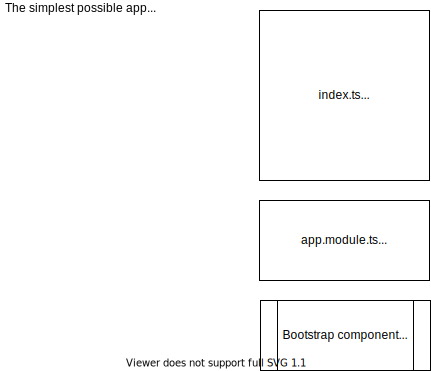
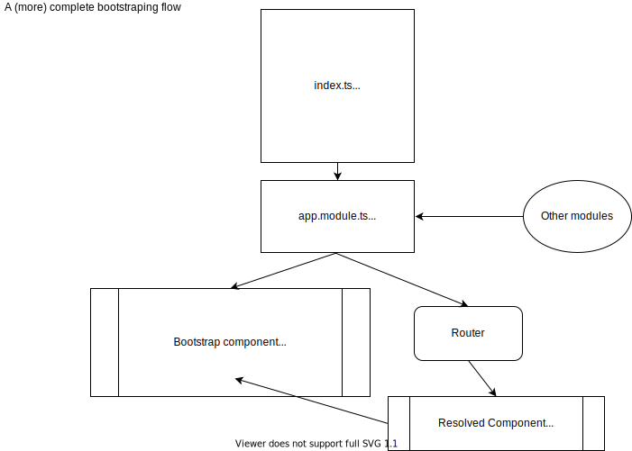

# welcome to day 1 of rt-ng

## Dependencies setup
 - [NodeJS](https://nodejs.org/en/) >= 10.13.0
 - npm package manager (installed with Node)
 - Angular cli `npm install -g @angular/cli` (-g switch is for global installation)
 - Patternfly 4 `npm i @patternfly/patternfly --save`
 - We also need to load patternfly css, via an import in style.scss or in angular json. I'll add `"node_modules/@patternfly/patternfly/patternfly.css"` in angular.json
 - Your favorite editor, I'll be using VS Code
 - Some helpful VS Code plugins:
    - ESLint
    - Prettier
    - Angular Language Service
    - Angular Essentials (collection of plugins)
    - This theme: Winter is coming

Note: Using a linter and an autoformatter (like ESLint and Prettier) is a huge win, but everybody on the teams should be using them with the same settings / rules.

## Building a new app
 - Let's review available [angular cli](https://cli.angular.io/) (ng cli) commands:
    - ng [command] [command params]
    - most commonn commands:
        - new (create new application) [app name]
        - generate (or just g) [component/service/directive...] [path/name]
        - add [package name] (adds a package like npm install package but does a few more things to congigure it, depending on it's schematics)
        - serve, build, test
- Create the app: `ng new ngrt`
    - Would you like to add Angular routing? (Y)
    - Which stylesheet format would you like to use? (SCSS)
- Move to the newly created directory and `ng serve` or `ng serve -o` to automatically open a browser

## An overview or our app and the framework
- package.json: Our project metadata. Some used by Node, some from npm to resolve dependencies.
- angular.json: Configuration defaults for build and development tools provided by the Angular CLI
- Other config that needs mentioning: tsconfig, karma.conf, tslint

### App bootstraping flow
- main.ts: entry file (see angular.json) initializes platform with a module (app.module by default)
- There can be only one platform instance, but it is possible to have multiple app instances
- app.module: sets up application wide dependencies and a bootstraping component (app.component by default)
- app.component: a basic building block


In a typical app, a better description of the bootstraping process would be something like this



Before building anything, let's briefly refresh what are the

### Angular building blocks

- modules:
Typescript classes decorated with @NgModule. Angular documentation says:
>An NgModule declares a compilation context for a set of components that is dedicated to an application domain, a workflow, or a closely related set of capabilities. An NgModule can associate its components with related code, such as services, to form functional units.

Every app must have one (only) root module and N other modules.

In practice, modules are an efficient way to organize, seperate and reuse functionality. Typically, an NgModule would have:
- declarations: the components that live inside this module
- imports: other modules we created or npm installed
- providers: instructions for the dependency injection system on obtaining a value. Providers can also be used in component level to change how dependency values are obtained - cool stuff.

Hint: each feature should exist under a seperate module.

- ### directives
    - **components**:
        
        Controls all or part of our screen. Everything we see is defined in the scope of a component, may as well be called a View.

        Usually, a component will consist of a typescript Class decorated with `@Component({..some config...})`, an html file, a stylesheed and a test file.

        Something important to remember is that we are heavily using component lifecycle hooks, like onInit, onDestroy, afterViewInit, afterContentInit... 

        Eg, if we need something to happen when component is instantiated, we'll attach it to onInit. If we are using a directive and need to access some DOM element, we'll be probably attach a handler in afterViewInit etc.
    
        In general, I prefer to seperate components in 2 main categories: presentation components, that have no logic and only get data as input and display them and "smart" components, that have access to other application services and pass data to presentation components.
        
        In complex apps, that might be an over simplification so we will need to apply more complex concepts.

    - **structural**:
        
        Structural directives have some logic that will change our DOM. They have an * at the begining and any html element can only have 1 structural directive.

        ```<div *ngFor="let item of items"> {{item}} </div>```
    - **attribute**:
        Attribute directives are used as a reference to an element, in order to access it and apply some logic.
        
        It can be a custom attribute (eg `<h1 fooBar>Something</h1>` or we can use already existing element, like input and css or other element attributes (eg a directive with selector `input[type="text"]` would have access to all input of type text elements)

- ### services
    Services are a very broad term. They are a typescript class or function, annotated with the @Injectable() decorator and **should have a narrow and very well defined scope**

    Ideally, a component will serve the minimum code required to apply the user experience and delegate any other tasks to services (use via DI).
    
    Like almost everything else, in services we'll be heavily using Observables (specifically RxJS). Promises are an option, but not suggested because 1. you'll be 'fighting' the framework flow, since RxJS is baked-in in all core parts and 2. Observables are a little harder to grasp at first but prove to be much more powerful eventually.

- ### pipes
    Pipes, again, are classes decorated with @Pipe(). The serve as a way to make display transformations in the html. There are several built-in pipes and ofcourse we can create our own. Common examples are date display, currency or more complex cases when we need to repeat some custom presentation logic.

- decorators
    Decorators exist in Typescript and angular is heavily using them to apply custom logic to almost every framework construct.

    There are a few kinds of decorators, like class or method etc and it is a very useful concept to apply when repeatable logic needs to be applied and class inheritence is not the best approach.

    In practice, the are just (higher order) functions, that receive a subject (like a class) and maybe some other properties and extends it's functionality.

- interceptors
- Interfaces / enums / tuples
    
    Nothing angular-specific to mention here, other than we can and we should have everything possible typed. The 'any' type will be a technical debt.

## Buildinng a layout shell

