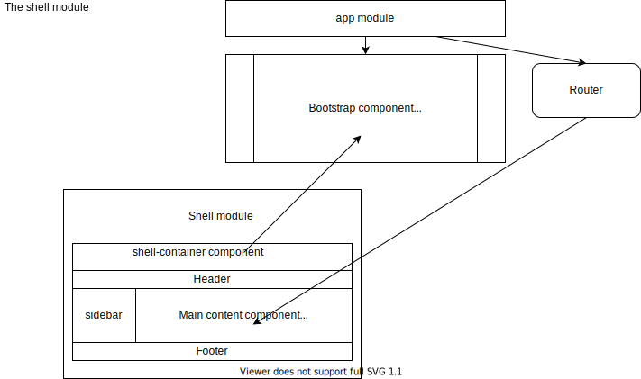

# IA2 Angular course - day 2

## Let's review the exercise "Buildinng a layout shell"
 

Our layout should be based on patternfly, and we have a good example for a similar layout: [this page layout](https://www.patternfly.org/v4/documentation/core/demos/page/default-nav). 

### Creating the module

The only difficult part in creating modules, components etc with cli is coming up with a good name and being consistent in our naming conventions :)

`ng generate module ui-shell` or the shortcut version which is exactly the same thing `ng g m ui-shell`

Note that there are more [switches we can use](https://angular.io/cli/generate#module-command) in creating a module but there's no need for these right now, we'll use some more options later.

OK we now have our empty module. Let's add a component to it, we should probably start with a wrapper that will contain everything.

`ng g c ui-shell/components/shell-wrapper`

Our component is automatically included in the ui-shell module, because of the path we gave it. But we will need to import ui-shell module in our root module (app module) so that our app knows about it's existence.

We intend on using the shell-wrapper component in the app module, so it's not enough to have it in the 'declarations' part of ui-shell module. We also need to export it.