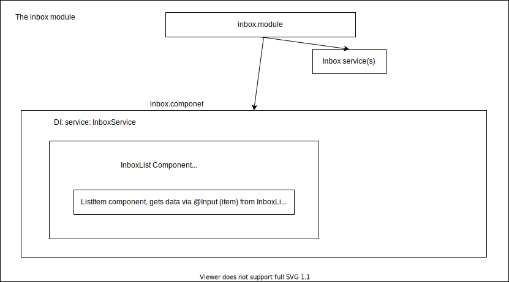

# IA2 Angular course - day 2

## Let's review the exercise "Buildinng a layout shell"
 


Our layout should be based on patternfly, and we have a good example for a similar layout: [this page layout](https://www.patternfly.org/v4/documentation/core/demos/page/default-nav). 

### Creating the module

The only difficult part in creating modules, components etc with cli is coming up with a good name and being consistent in our naming conventions :)

`ng generate module ui-shell` or the shortcut version which is exactly the same thing `ng g m ui-shell`

Note that there are more [switches we can use](https://angular.io/cli/generate#module-command) in creating a module but there's no need for these right now, we'll use some more options later.

OK we now have our empty module. Let's add a component to it, we should probably start with a wrapper that will contain everything.

`ng g c ui-shell/components/shell-wrapper`

Our component is automatically included in the ui-shell module, because of the path we gave it. But we will need to import ui-shell module in our root module (app module) so that our app knows about it's existence.

We intend on using the shell-wrapper component in the app module, so it's not enough to have it in the 'declarations' part of ui-shell module. We also need to export it.

OK now lets copy all of the html in the [demo patternfly page](https://www.patternfly.org/v4/documentation/core/demos/page/default-nav) to our wrapper, and take it from there.

We now have the full page rendered in one wraper component. What we want to end up with, is a wraper that has a header, a left panel, a footer and our main conntent area (in which we will also have to add the router render place holder - `<router-outlet></router-outlet>`)

So our wraper html will look something like this:

```html
<shell-header></shell-header>
<shell-left-panel></shell-left-panel>
<shell-main-content></shell-main-content>
```

These will be mostly presentation components, so let's create them in a seperate folder to keep things a little more clean:

`ng g c ui-shell/components/presentation/header`

`ng g c ui-shell/components/presentation/sidebar`

`ng g c ui-shell/components/presentation/main`

then move the corresponding html to each component, so that our `app-shell-wrapper`'s html only has the tags to render the new components:

```html
<div class="pf-c-page">
  <app-header></app-header>
  <app-sidebar></app-sidebar>
  <app-main></app-main>
</div>
```

There are some css issues to solve here, since the rendered html actually contains some extra elements, our components. A quick fix (not the best, if we need to support older browsers) is to use in each component's scss file this rule:

`:host { display: contents}`

host represents the component element and we are instructing css to ignore it and only apply rules to it's contents.

The app-main component, just needs to include `<router-outlet></router-outlet>` in the right place. But when we include it, you'll notice there's something wrong... since we're using the router outlet in ui-shell, we need to import angular router in the module. We'll talk about module dependencies and imports strategy later on, when we start dealing with lazy loaded modules and things get a little more complex in this aspect.

Just a little clean up in the html to remove unnecessary content and we are ready. We now have a shell, ready to render any route in the app-main comonent!

## Creating our first feature: Inbox

Before starting the inbox, let's do 2 things:

- Create a features folder that will host all our ...features (remember the structure guidelines?)
- Create a demo component (lets call it home), just to have something in our default route (and create this route)

`ng g c home`

and add these in app.routing module

```html
{ path: '', redirectTo: '/inbox', pathMatch: 'full' },
{ path: 'home', component: HomeComponent },
```
Done, let's start with the inbox.

Our inbox will be a classic MiTOS inbox, with a list of applications that might have different layout semantics (eg different backgound for x type of application). We also need them to be expandable, and display some extra info (we will ignore other common features, like pagination, filters etc).

Inbox will be rendered in it's own url, have it's own logic and components so it's  a good candidate for a lazy loaded module.

Let's do that, create an inbox wraper to see the differences of a lazy loaded module and then discuss about how we should structure it's pieces.

`ng g m features/inbox --route inbox --module app.module`

This did some more things than just create a new module: It also created an inbox routing module, a default component the route will resolve at and added a new LAZY loaded route in our root routing module!

(Since this is our first route, we also need to create a default route. And while we're at it, let's also add a default route link and an inbox link to our sidebar)

`<a [routerLink]="['/inbox']" routerLinkActive="active" class="pf-c-nav__link pf-m-current">Inbox</a>`

We can already go to /inbox and see what happens...

Check (network tab) how the new inbox module, is loaded when the url is pointing to it only. Otherwise, this code will never reach the client browser (and that's great for our bundle size)...

Sounds good? lets give our module structure some design:

- It will surely have a service, to get data
- We will need a List component. Definatelly.
- We will also need a List item component. Maybe more than one? we'll see
- We will probably need another componnent for the extra details. Let's call it item details.

I think we should make all of them just dumb, rendering components and just pass them some data to render. All of the logic could be handled from the (already existing) inbox.component.



`ng g s features/inbox/services/task-data`

`ng g c features/inbox/components/list`

`ng g c features/inbox/components/list-item`

`ng g c features/inbox/components/list-item-details`

What would be great now, is if we could have a sample layout from patternfly, which looks very close to what we actually want... [tadaaaa...](https://www.patternfly.org/v4/documentation/core/demos/datalist/expandable-demo)

You know the drill, we'll take the (list part of the) content, put it initially in the inbox.component and take it from there.

Cool. We should now have a list with one item with random data. Next steps:

- get actual data
- wire up bindings, inputs etc
- make the item details toggler actually toggle its content

Since we'll be using http, we should add HttpClientModule to the app module too

For data, we'll use star wars instead of deals for a change. So, let's set up the data service:

The base URI is `https://swapi.co/api/` and we'll be consuming a collection of available movies for our list, so its `https://swapi.co/api/films/`


We'll also need a Movie interface, I'll keep it in the service file for convenience. You should not.

```javascript
export interface Movie {
  title: string;// -- The title of this film
  episode_id: number;// -- The episode number of this film.
  opening_crawl: string;// -- The opening paragraphs at the beginning of this film.
  director: string;// -- The name of the director of this film.
  producer: string;// -- The name(s) of the producer(s) of this film. Comma separated.
  release_date: string;// -- The ISO 8601 date format of film release at original creator country.
  species: [];// -- An array of species resource URLs that are in this film.
  starships: [];// -- An array of starship resource URLs that are in this film.
  vehicles: [];// -- An array of vehicle resource URLs that are in this film.
  characters: [];// -- An array of people resource URLs that are in this film.
  planets: [];// -- An array of planet resource URLs that are in this film.
  url: string;// -- the hypermedia URL of this resource.
  created: string;// -- the ISO 8601 date format of the time that this resource was created.
  edited: string;//
}```

Import the service and use it as an observable with async pipe in your html. Alternatively, subscribe and assign it to non-async variable but dont forget to unsubscribe.

We'll use title, episode_id, director and producer in main item view and the movie opening crawl in details view.

Setup Input in the components and pass data from each parent to child as needed.

Great. Now, what do we need to do to actually use the details toggler? 

There is a class in the list item, `pf-m-expanded` which should define the expanded state.

It should be ease to use a property in the item component to enable / disable this class and the details visibility...

Also, maybe we could use a [loader]{https://www.patternfly.org/v4/documentation/core/components/spinner} to show while the items are loading...

One more thing. We need all episodes not directed by George Lucas to have a different color. Or, in a more general approach, we want some layout behavior, driven by our data.

We can surely add an ngClass in our item template, with a condition to check the director. This would work:

`[ngClass]="{'some-class': item.director === 'George Lucas'}"` and then use some css to change the background or something. But we'd like to avoid applying logic inside the html and we want reusable pieces of code, if possible. Also, chances are, client will come up with more conditional checks and more behavior... it will become hard to read and maintain (you all knonw what I mean!)

I thing an attribute directive would be a much better solution for this job. Let's see how we can do this.

`ng g d features/inbox/directives/tpl-modifier`

There are several ways to access and modify host element properties, let's discuss that and fininsh up with the directive.


